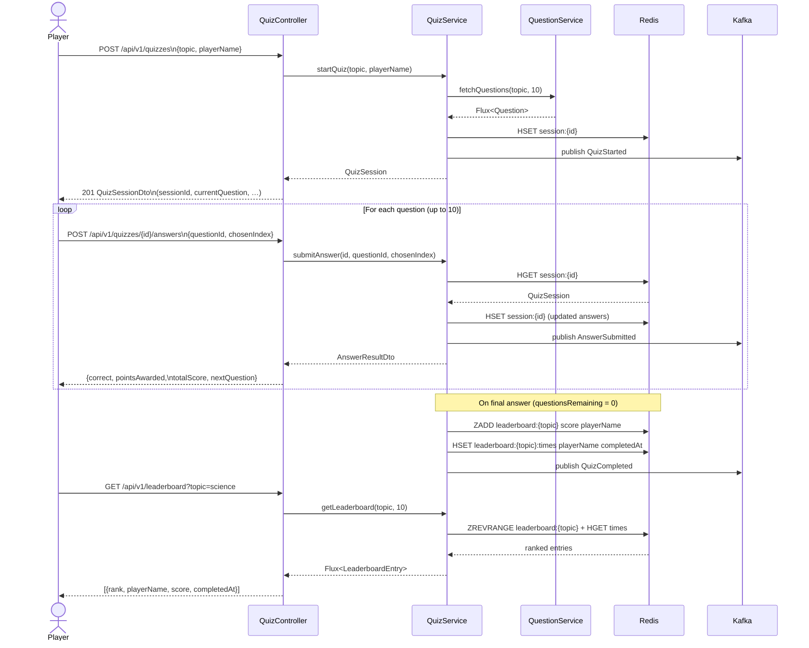

# Sequence Diagram

```mermaid
sequenceDiagram
    actor Player
    participant API as QuizController
    participant SVC as QuizService
    participant QS as QuestionService
    participant Redis
    participant Kafka

    Player->>API: POST /api/v1/quizzes\n{topic, playerName}
    API->>SVC: startQuiz(topic, playerName)
    SVC->>QS: fetchQuestions(topic, 10)
    QS-->>SVC: Flux<Question>
    SVC->>Redis: HSET session:{id}
    SVC->>Kafka: publish QuizStarted
    SVC-->>API: QuizSession
    API-->>Player: 201 QuizSessionDto\n(sessionId, currentQuestion, …)

    loop For each question (up to 10)
        Player->>API: POST /api/v1/quizzes/{id}/answers\n{questionId, chosenIndex}
        API->>SVC: submitAnswer(id, questionId, chosenIndex)
        SVC->>Redis: HGET session:{id}
        Redis-->>SVC: QuizSession
        SVC->>Redis: HSET session:{id} (updated answers)
        SVC->>Kafka: publish AnswerSubmitted
        SVC-->>API: AnswerResultDto
        API-->>Player: {correct, pointsAwarded,\ntotalScore, nextQuestion}
    end

    Note over SVC,Redis: On final answer (questionsRemaining = 0)
    SVC->>Redis: ZADD leaderboard:{topic} score playerName
    SVC->>Redis: HSET leaderboard:{topic}:times playerName completedAt
    SVC->>Kafka: publish QuizCompleted

    Player->>API: GET /api/v1/leaderboard?topic=science
    API->>SVC: getLeaderboard(topic, 10)
    SVC->>Redis: ZREVRANGE leaderboard:{topic} + HGET times
    Redis-->>SVC: ranked entries
    SVC-->>API: Flux<LeaderboardEntry>
    API-->>Player: [{rank, playerName, score, completedAt}]
```