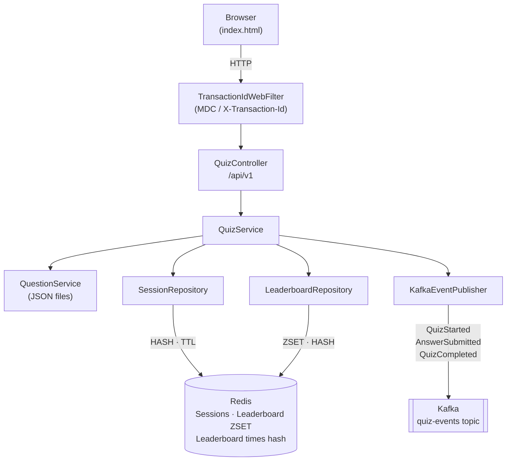

# System Diagram

```mermaid
graph TD
    Browser["Browser\n(index.html)"]
    Filter["TransactionIdWebFilter\n(MDC / X-Transaction-Id)"]
    Controller["QuizController\n/api/v1"]
    Service["QuizService"]
    QS["QuestionService\n(JSON files)"]
    SR["SessionRepository"]
    LR["LeaderboardRepository"]
    Redis[("Redis\nSessions · Leaderboard ZSET\nLeaderboard times hash")]
    Kafka[["Kafka\nquiz-events topic"]]
    KEP["KafkaEventPublisher"]

    Browser -->|HTTP| Filter
    Filter --> Controller
    Controller --> Service
    Service --> QS
    Service --> SR
    Service --> LR
    Service --> KEP
    SR -->|HASH · TTL| Redis
    LR -->|ZSET · HASH| Redis
    KEP -->|QuizStarted\nAnswerSubmitted\nQuizCompleted| Kafka
```